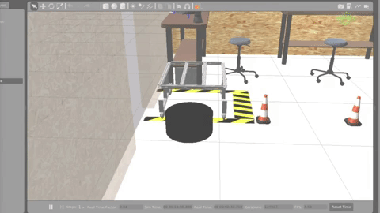

# CheckPoint 5 Master ROS2

<a name="readme-top"></a>

<!-- TABLE OF CONTENTS -->
<details>
  <summary>Table of Contents</summary>
  <ol>
    <li>
      <a href="#about-the-project">About The Project</a>
    </li>
    <li>
      <a href="#getting-started">Getting Started</a>
      <ul>
        <li><a href="#software-prerequisites">Software Prerequisites</a></li>
        <li><a href="#hardware-prerequisites">Hardware Prerequisites</a></li>
        <li><a href="#installation">Installation</a></li>
      </ul>
    </li>
    <li><a href="#usage">Usage</a></li>
    <li><a href="#real-robot">Real Robot</a></li>
  </ol>
</details>


## About The Project
The purpose of this project is to create a program that allows the robot to approach, detect and attach to a warehouse shelf.
In the first part of the project, a simple ROS2 node that performs the pre-approach motion was created. This is, move the robot near the location of the shelf. Then a ROS2 node that performs the final approach motion was created. 

</br>

Final approach:
* Detects the exact position of the shelf.
* Commands the robot right beneath the shelf.
* Attaches the robot to the shelf.



<!-- GETTING STARTED -->
## Getting Started

### Software Prerequisites
* Ubuntu 22.04
* ROS1 Noetic
* ROS2 Foxy

<p align="right">(<a href="#readme-top">back to top</a>)</p>

<!-- INSTALLATION -->
### Installation
1. Clone the repo:
   ```sh
   cd ~ && \
   git clone https://github.com/pvela2017/The-Construct-CheckPoint-3-ROS2-Basics-CPP
   ```
2. Compile the simulation:
   ```sh
   source /opt/ros/noetic/setup.bash && \
   cd ~/The-Construct-CheckPoint-3-ROS2-Basics-CPP/simulation_ws && \
   catkin_make && \
   cd ~/The-Construct-CheckPoint-3-ROS2-Basics-CPP/catkin_ws && \
   catkin_make && \
   source /opt/ros/foxy/setup.bash && \
   cd ~/The-Construct-CheckPoint-3-ROS2-Basics-CPP/ros2_ws && \
   colcon build
   ```
     
<p align="right">(<a href="#readme-top">back to top</a>)</p>


<!-- USAGE -->
## Usage
### Local Simulation & Real Robot
1. Launch the simulation:
   ```sh
   source /opt/ros/noetic/setup.bash && \
   source ~/The-Construct-CheckPoint-3-ROS2-Basics-CPP/simulation_ws/devel/setup.bash && \
   roslaunch realrobotlab main.launch
   ```
2. Launch the ros bridge:
   ```sh
   source /opt/ros/noetic/setup.bash && \
   source ~/The-Construct-CheckPoint-3-ROS2-Basics-CPP/catkin_ws/devel/setup.bash && \
   roslaunch load_params load_params.launch && \
   source /opt/ros/foxy/setup.bash && \
   ros2 run ros1_bridge parameter_bridge && \
   ```
3. Launch patrol node:
   ```sh
   source /opt/ros/foxy/setup.bash && \
   source ~/The-Construct-CheckPoint-3-ROS2-Basics-CPP/ros2_ws/install/setup.bash && \
   ros2 launch robot_patrol start_patrolling.launch.py
   ```
4. Launch and test the service the service:
   ```sh
   source /opt/ros/foxy/setup.bash && \
   source ~/The-Construct-CheckPoint-3-ROS2-Basics-CPP/ros2_ws/install/setup.bash && \
   ros2 launch robot_patrol start_direction_service.launch.py && \
   ros2 launch robot_patrol start_test_service.launch.py
   ```
5. Move the robot using the service:
   ```sh
   source /opt/ros/foxy/setup.bash && \
   source ~/The-Construct-CheckPoint-3-ROS2-Basics-CPP/ros2_ws/install/setup.bash && \
   ros2 launch robot_patrol main.launch.py
   
   ```
6. Move the robot using an action server:
   ```sh
   source /opt/ros/foxy/setup.bash && \
   source ~/The-Construct-CheckPoint-3-ROS2-Basics-CPP/ros2_ws/install/setup.bash && \
   ros2 launch robot_patrol start_gotopoint_action.launch.py
   ```

<p align="right">(<a href="#readme-top">back to top</a>)</p>


<!-- KEYS -->
## Key topics learnt
* Use services
* Use actions.
* Check if the custom action has been created.
```sh
ros2 interface show robot_patrol/action/GoToPoint
```
